_This is not meant as a comprehensive report, but is instead intended as particular observations that we've made that may be of relevance. Please also note that observed patterns reflect the GISAID database and may not be entirely representative of underlying dynamics._

## A/H3N2

**We expect clade 3c2.a viruses to further predominate over 3c3.a and 3c3.b viruses. We do not observe the appearance of additional fast growing clades indicative of the emergence of new antigenic variants.**

There were 4 clades of H3N2 viruses circulating in 2015 (3c2.a, 3c3.a, 3c3.b and ancestral 3c3). 3c2.a viruses have predominated with 78% of 2015 viruses belonging to clade 3c2.a, while 12% of viruses belonged to clade 3c3.a and 6% of viruses belonged to clade 3c3.b. Clades 3c2.a, 3c3.a and 3c3.b can easily be distinguished by the residue at HA1 site 159. In 3c2.a this is tyrosine (Y), in 3c3.a this is serine (S) and in 3c3.b this is phenylalanine (F).

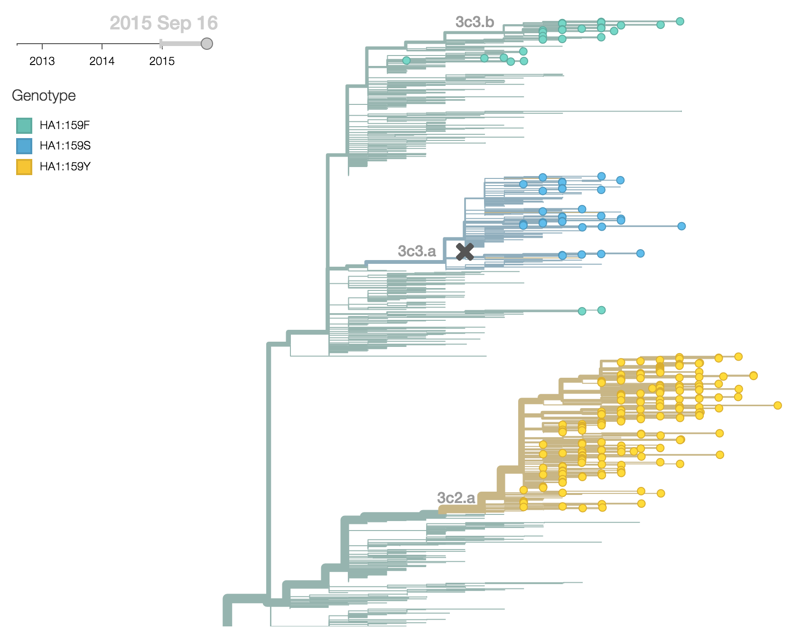

3c2.a has been increasing in frequency, going from 50% globally in October 2014 to 80% of post-July viruses. 3c3.a has been steadily decreasing in frequency, going from a peak of 54% in August 2014 to a present low of 10% of post-July viruses. The first 3c3.b viruses appear in the database in August 2014. They have been slow to take off; just 2% of post-July viruses belong to clade 3c3.b. In fact, 3c3.b viruses appear to have peaked in frequency in May/June at 8%. For perspective, 3c2.a viruses first appear in the database in November 2013 and reach 10% frequency two months later in January 2014 and 50% eleven months later. 3c3.b viruses show no where near this level of success. Barring additional antigenic changes, it appears that 3c2.a viruses will take over the virus population and that 3c3.a and 3c3.b will soon be extinct.

These patterns of clade growth and decline extend to the regional level. 3c2.a viruses now dominate throughout the world. 3c3.b viruses briefly increased in frequency in Europe, but have declined in frequency in recent samples.

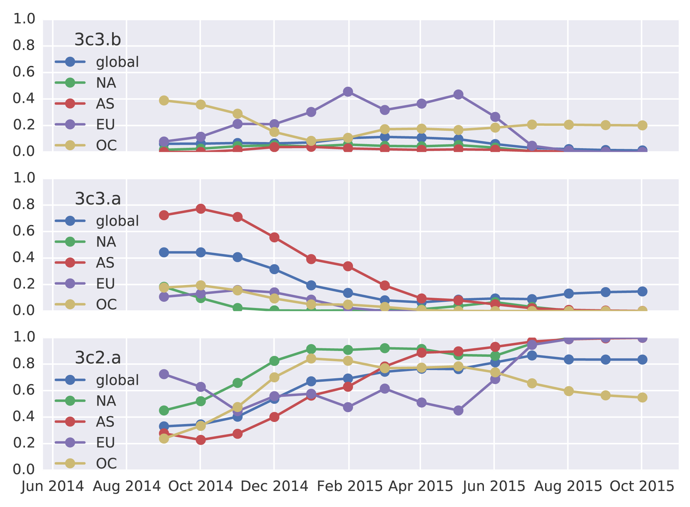

The continued dominance of 3c2.a is corroborated with a large local branching index and comparatively low mutational load as measured by the number of non-epitope substitutions since the root of the tree. Within 3c2.a, one clade (the uppermost clade with in 3c2.a) is starting to dominate but this clade is not characterized by any amino acid differences within HA. We observe no rapidly expanding subclades within 3c2.a or 3c3.b.

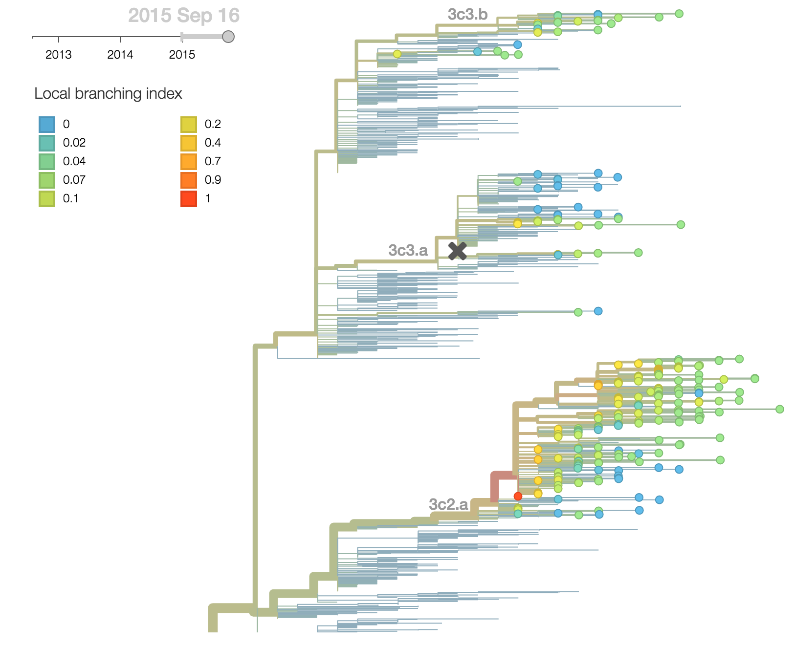

Summarizing data from [recent reports](http://www.crick.ac.uk/research/worldwide-influenza-centre/annual-and-interim-reports/) by the WHO CC London, we observe approximately a 2.8-fold drop in titer between serum raised against vaccine strain A/Switzerland/9715293/2013 and 3c2.a viruses. This corresponds to a 1.5 antigenic unit distance between clades. This can be seen on the left in the raw titer data (viruses are colored based on titer drop relative to A/Switzerland/9715293/2013 serum) and also on the right in a statistical model of titer drop. The statistical model finds that 3c2.a and 3c3.a both appear homogeneous in terms of titer measurements within the clade, further supporting the absence of new adaptive variants. Note however, that this analysis is averaging across the serum NIBF13/14 raised against cell-culture virus and the serum F25/14 raised against egg-culture virus.

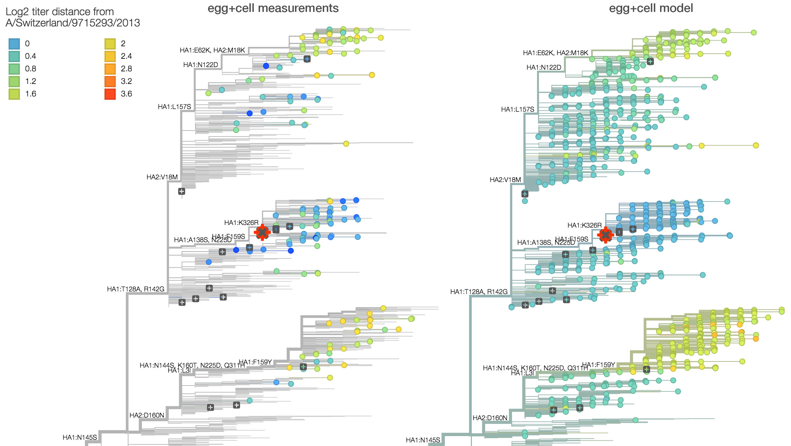

Here we compare titer measurements between cell-culture based serum NIBF13/14 on the left and the egg-culture based serum F25/14 on the right. Averaged across measurements, titer drop between cell-culture serum and egg-culture serum is similar with an average antigenic distance of 1.5 for cell-culture measurements and an average antigenic distance of 1.5 for egg-culture measurements. Note however, that absolute titers against F25/14 are higher than against NIBF13/14. This suggests higher "serum potency" in the egg-culture serum, although we do not observe a difference in titer drop. This suggests that egg-adaptation during production of serum F25/14 did not result in antigenic change relative to 3c2.a viruses.

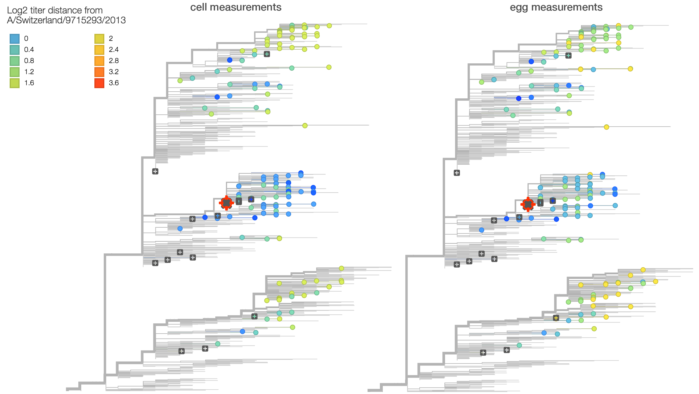

Thus, 3c2.a and 3c3.a viruses, although not antigenically identical appear quite similar. Observed rapid displacement of 3c3.a viruses by 3c2.a viruses makes sense in this context, i.e. we expect strong immunological competition between clades.

## A/H1N1pdm

**We observe the continued dominance of clade 6b viruses, although the substitution HA1:84N has recently risen to high frequency in South Asia.**

For H1N1pdm viruses, the clade 6b has been slowly increasing in frequency since 2013, so that we now find that 99.5% of 2015 viruses belong to clade 6b. Within this clade two recent substitutions in particular have reached appreciable frequency, HA1:84N and HA2:164G. We find that 20% of 2015 viruses are 84N and 11% of 2015 viruses are 164G.

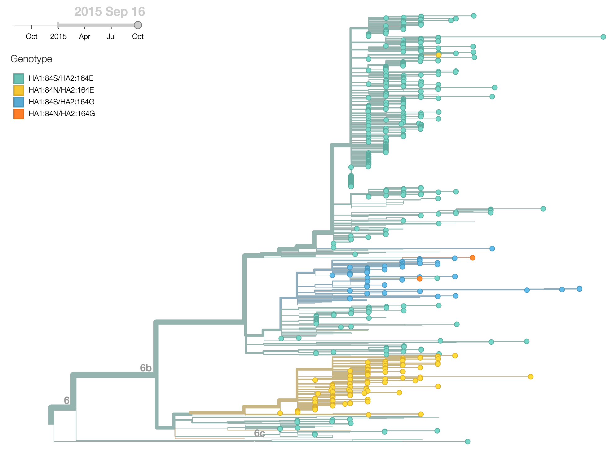

The HA1:84N substitution shows substantial geographic subdivision with this clade predominating in South Asia. Fully 66% of 2015 viruses isolated from South Asia possess HA1:84N.

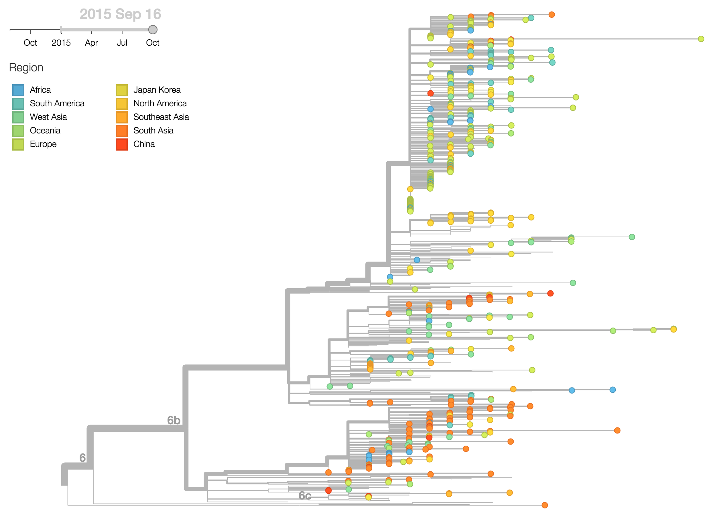

Analyzing frequency trajectories of HA1:84N and HA2:164G shows a similar picture with a recent increase in frequency of 84N in South Asia. It remains to be fully resolved whether there is an association between the HA1:84N substitution and the severe [2015 Indian H1N1pdm epidemic](https://en.wikipedia.org/wiki/2015_Indian_swine_flu_outbreak).

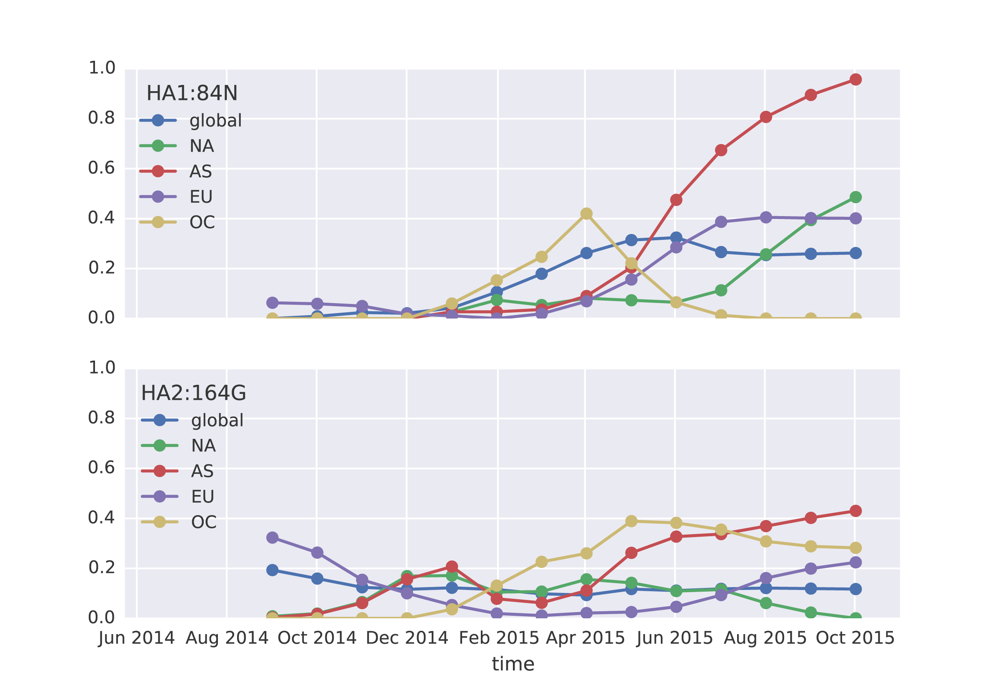

We observe no emerging clades of H1N1pdm that appear to be rapidly expanding, suggesting the absence of novel antigenic variants. Still, in light of the previous season's Indian outbreak, we suggest careful attention to the HA1:84N substitution to monitor further geographic spread and clade growth.

## B/Vic

**Clade 1A viruses have predominated the B/Vic population with a recent emergence and spread of substitution HA1:129D**

B/Victoria viruses isolated during 2015 were almost entirely 1A viruses, with 1B viruses almost entirely extinct. Within 1A viruses, there were three main groups: ancestral 1A viruses possessing 129N and 209K, derived viruses possessing 129N and 209N and derived viruses possessing 129D and 209K.

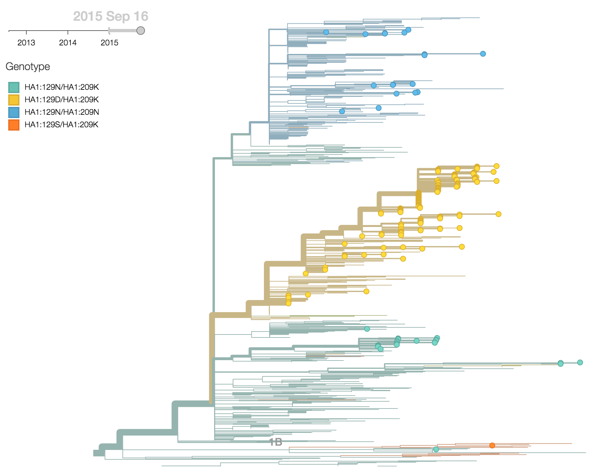

The 129D/209K clade has been continually expanding after first appearing in late 2012. It comprised 77% of 2015 viruses.

## B/Yam

**Clade 3 has predominated the B/Yamagata population with the recent emergence and spread of the substitution HA1:172Q.**

B/Yamagata viruses isolated during 2015 were predominately clade 3, with 97% of viruses belonging to clade 3 and just 3% belonging to clade 2. Within clade 3 viruses, the substitution HA1:172Q rose rapidly in frequency during 2014.

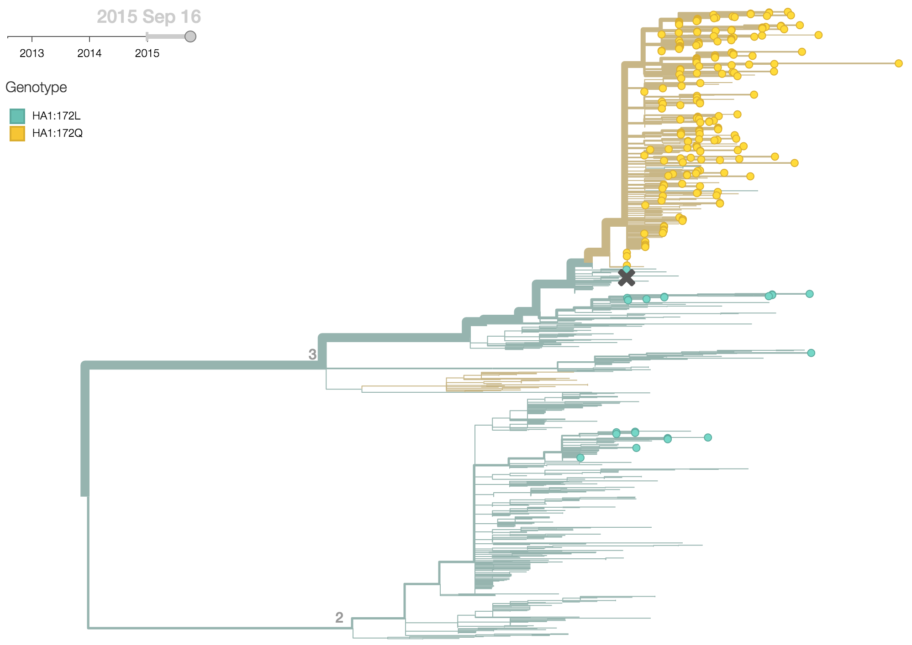

More recently, the substitution HA1:251V has emerged within the HA1:172Q clade of viruses. The HA1:251V substitution has steadily increased in frequency throughout 2015.

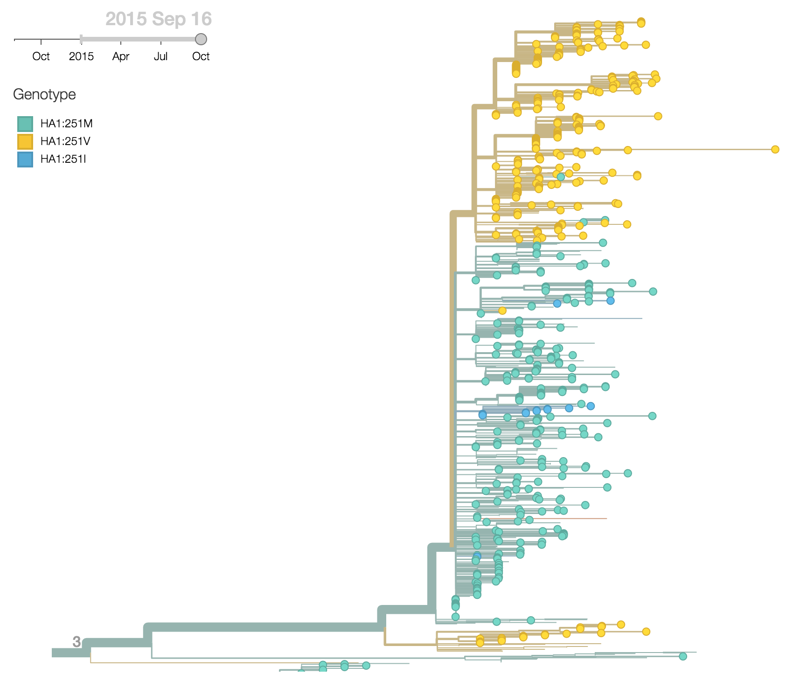

.

---

Written by [Trevor Bedford](bedfor.io) and [Richard Neher](https://neherlab.wordpress.com/). This work is made possible by the [GISAID Initiative](http://gisaid.org/) and the open sharing of genetic data by influenza research groups from all over the world. [We gratefully acknowledge their contributions.](http://nextflu.org/acknowledgements/) Give us a shout at [@trvrb](https://twitter.com/trvrb) or [@richardneher](https://twitter.com/richardneher) with questions or comments.

Please cite: [Neher RA, Bedford T. 2015. nextflu: real-time tracking of seasonal influenza virus evolution in humans. Bioinformatics 10.1093/bioinformatics/btv381](http://dx.doi.org/10.1093/bioinformatics/btv381).

---
